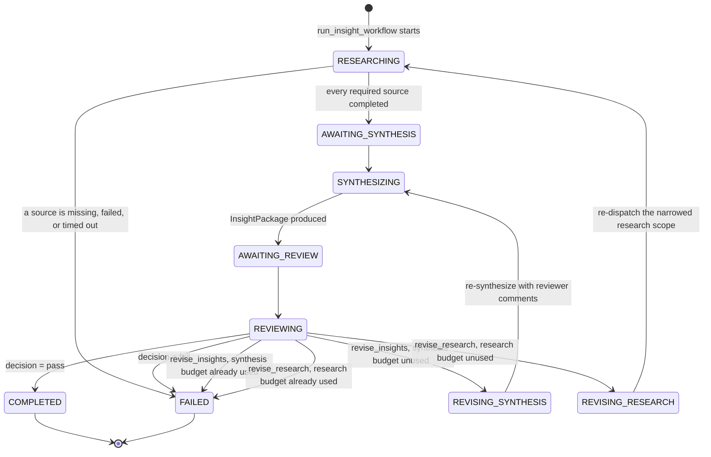
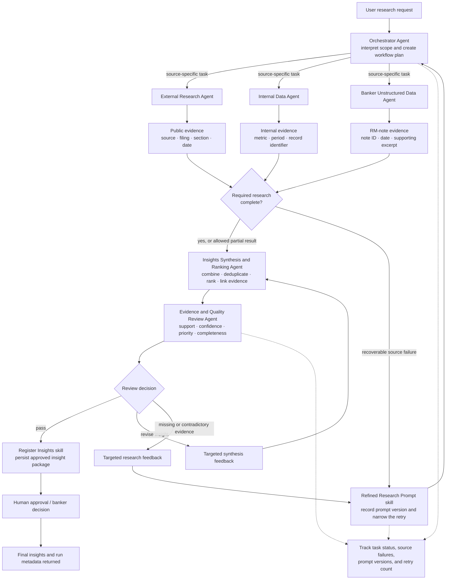

# Insights Assistant: Multi-Agent Design

## Problem and rationale

Insights Assistant combines structured internal banking data, public-company information, and unstructured notes from client-facing employees to produce actionable, evidence-backed insights. Typical insight categories include growth opportunities, relationship risks, and product-development opportunities.

A single agent is poorly suited to this work because each source has different access patterns and interpretation rules:

- Structured internal metrics require precise querying and controlled access.
- Relationship-manager notes require semantic retrieval and careful interpretation.
- Public-company research requires an external search strategy and durable source identifiers.
- Combining retrieval, analysis, synthesis, and review in one prompt increases context size and makes attribution and error isolation less reliable.

The proposed design uses six agents. This provides meaningful separation of responsibilities without excessive coordination overhead. Each specialist receives only the tools and rules needed for its source, while structured contracts limit ambiguous or oversized handoffs.

## Agent roles

1. **Orchestrator Agent** — Interprets the request, defines the research scope, routes work, tracks task and source failures, invokes synthesis and review, and returns final run metadata.
2. **External Research Agent** — Researches approved public sources, primarily SEC filings. It identifies material changes in strategy, liquidity, debt, acquisitions, capital allocation, disclosed risks, and technology investment. Every finding retains its source, filing, section, and date.
3. **Internal Data Agent** — Examines structured banking data such as profitability, credit exposure, deposits, payment activity, products, and pipeline information.
4. **Banker Unstructured Data Agent** — Retrieves and analyzes relationship-manager notes for client sentiment, observations, concerns, and explicit relationship-risk statements. Every finding retains its note identifier and date.
5. **Insights Synthesis and Ranking Agent** — Combines specialist findings, removes duplicates, and generates banker-facing insights. Each insight includes a finding, why it matters, a recommended action, priority, confidence, category, and linked evidence.
6. **Evidence and Quality Review Agent** — Independently checks whether evidence supports each claim, whether confidence and priority are justified, and whether the result set satisfies the original request. It either passes the package or returns targeted revision feedback.

Human approval remains the final control for high-impact banking decisions.

## Implementation status

The Insights Synthesis and Ranking Agent, the Evidence and Quality Review
Agent, and the deterministic state machine coordinating them are
**implemented**, not aspirational:

- `agents/synthesizer.py` — `synthesize_insight_package()`. Never invokes a
  specialist agent; resolves evidence codes and each insight's company
  attribution against the real `SourcePayload` records it's given (never
  trusting the LLM's own copy of either verbatim); ranks insights
  deterministically via a stable multi-key sort over the requested ranking
  criteria, in Python, not the model.
- `agents/reviewer.py` — `review_insight_package()`. Receives only the
  original request, preferences, insight requirements, the source manifest/
  payloads, and the `InsightPackage` — never chain-of-thought from
  synthesis. Its output is a `ReviewDecision` (`pass` / `revise_insights` /
  `revise_research` / `fail`) with concise, decision-oriented `comments` —
  the only free-text field this agent produces, designed from the start to
  be safe to show a banker directly.
- `agents/insight_workflow.py` — `run_insight_workflow()`, the state machine
  below. Two independent revision budgets (`WorkflowState.
  research_revision_count` / `synthesis_revision_count`, contracts/workflow/
  state.py): research is capped at exactly one use; synthesis is capped at
  `INSIGHTS_MAX_SYNTHESIS_REVISIONS` uses (contracts/workflow/config.py,
  default 2, env-overridable). Once either budget is exhausted, a further
  attempt at that kind of revision is turned into a terminal `failed`
  state, never an unbounded loop. Separately, and not counted against
  either budget, `_synthesize_with_validation_retry` retries one revision
  attempt's own synthesis call internally, up to
  `INSIGHTS_SYNTHESIS_VALIDATION_RETRY_LIMIT` times (default 2), when it
  fails the deterministic revision-feedback check
  (`SynthesisRevisionValidationError`) -- ordinary LLM sampling variance on
  a single call shouldn't burn a reviewer-driven revision the Reviewer
  never got another chance to weigh in on.
- `api/server.py` mirrors every intermediate `WorkflowState` (not just the
  final one) into the polled `ResearchRequest` resource live, via
  `run_insight_workflow`'s `on_state_change` callback — see "Exposing
  workflow state to the frontend" below.

The specialist agents (External Research, Internal Data, Banker
Unstructured Data) are implemented as deterministic, directly-dispatched
calls in `agents/research_execution.py` (one task per required
company/source pair, joined with a bounded-timeout barrier) rather than
LLM-routed supervisor delegation — routing which sources run for a request
is a fixed function of the request's scope, not a judgment call worth
spending a model call on.

## Implemented workflow state machine

Every state above is a real `contracts.workflow.enums.WorkflowStage` value.
Both revision budgets are independent — a request can use the research
revision once *and* the synthesis revision up to `INSIGHTS_MAX_SYNTHESIS_
REVISIONS` times (default 2, in any order relative to the research
revision) before a further revision attempt of either kind is forced to
`FAILED`; at most `2 + INSIGHTS_MAX_SYNTHESIS_REVISIONS` Reviewer calls ever
happen for one request (initial review, plus one review per accepted
revision of either kind — 4 by default). No LLM output decides which
transition fires other than the *content* of a `ReviewDecision` — the
budget check, the terminal condition, and every counter are ordinary Python
in `agents/insight_workflow.py` and `contracts/workflow/state.py`.

A `revise_insights` round's own synthesis call can additionally fail a
*deterministic* check (`SynthesisRevisionValidationError` — did the
regenerated package actually account for every insight the Reviewer
flagged?) independent of whether the revision budget itself is exhausted;
`agents/insight_workflow.py`'s `_synthesize_with_validation_retry` retries
that one call internally (`INSIGHTS_SYNTHESIS_VALIDATION_RETRY_LIMIT`
attempts, default 2) before giving up, without spending another unit of
`synthesis_revision_count` or calling the Reviewer again in between.

### Exposing workflow state to the frontend

`GET /api/requests/{id}` (`api/server.py`) surfaces this state machine
directly: `currentStage` (a coarser nine-value display vocabulary —
`queued`/`researching`/`waiting_for_sources`/`synthesizing`/`reviewing`/
`revising_synthesis`/`revising_research`/`completed`/`failed`) alongside the
existing `status` field every poller already understands, plus
`requestVersion`/`packageVersion`/`researchRevisionCount`/
`synthesisRevisionCount`, `sourceErrors[]`, `reviewDecision`/
`reviewComments`, `auditEvents[]` (the compact version history), and
`unmetRequirements[]`. `waiting_for_sources` and `reviewing` each fold two
`WorkflowStage` values together (`AWAITING_SYNTHESIS`→researching's
handoff, `AWAITING_REVIEW`→reviewing's handoff) because they're momentary
transitions between synchronous `await` calls, never independently
observable by a poller — folding them is an honest simplification, not a
missing state. All of these fields are additive on the existing
`ResearchRequest` shape; a client that doesn't know about them keeps
working unchanged.

## End-to-end flow

The three research agents run concurrently after planning because their work is largely independent. Synthesis waits only for required dependencies; optional-source failures can be carried forward explicitly as partial-result metadata.

## Coordination and controls

- Communication is one-way and structured for the main path: orchestrator to specialists, specialists to synthesis, and synthesis to review.
- Feedback is bounded and targeted. Review may return an unsupported insight to synthesis or send a missing/contradictory evidence issue back through the refined-research path.
- The orchestrator records retry count and prompt versions. Two independent revision budgets — at most one research revision, and at most `INSIGHTS_MAX_SYNTHESIS_REVISIONS` synthesis revisions (default 2) per request (`WorkflowState.research_revision_count` / `synthesis_revision_count`) — bound the loop structurally; exceeding either returns a failed result instead of permitting an endless agent loop. See "Implemented workflow state machine" above for the exact transitions.
- Evidence references are preserved through every handoff. Inference must be labeled separately from source facts.
- Source failures are explicit; successful evidence from other sources is not silently discarded.
- Registration occurs only after the quality review passes.

## Trade-offs and scalability

The primary trade-off is reliability versus latency. Parallel research reduces elapsed time, while independent review adds a model call and may trigger a targeted retry. This additional cost is justified where unsupported claims or incorrect rankings would create material risk.

The architecture scales in two ways: research can run concurrently across existing sources, and new specialist agents or tools can be introduced behind the same evidence contract without redesigning the full workflow. Clear source boundaries, evidence traceability, graceful partial failure, bounded feedback, and human oversight remain the system's governing properties.
